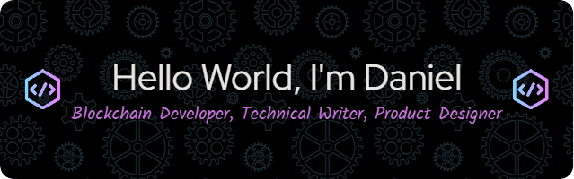
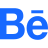

 &nbsp;

 &nbsp;

 &nbsp;

 &nbsp;

- 🔭 I'm currently working as a freelancer and hackathon surfer.
- 👀 I'm interested in Hackathons, Blockchain Development, UI/UX Design and Technical Writing.
- 🌱 Learning German, Spanish and Mandarin.
- 💞️ I'm looking to collaborate on Web2, Web3 and UI/UX projects.
- ⚡ Fun fact: When I'm not coding or designing, I'm either playing basketball, trying out new recipes, reading a book from my library or sleeping.

## 💡 Quote For Devs and Designers:

## 💻 My Tech Stack:

## 📖 Read My Blogs:

    &nbsp;&nbsp;
    &nbsp;&nbsp;
    &nbsp;&nbsp;

## 🏆 My Stats:
